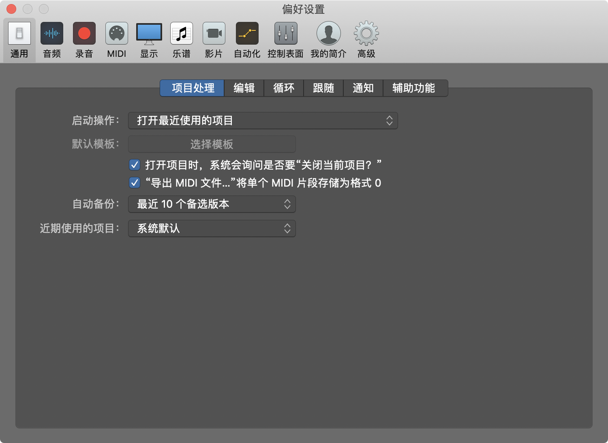
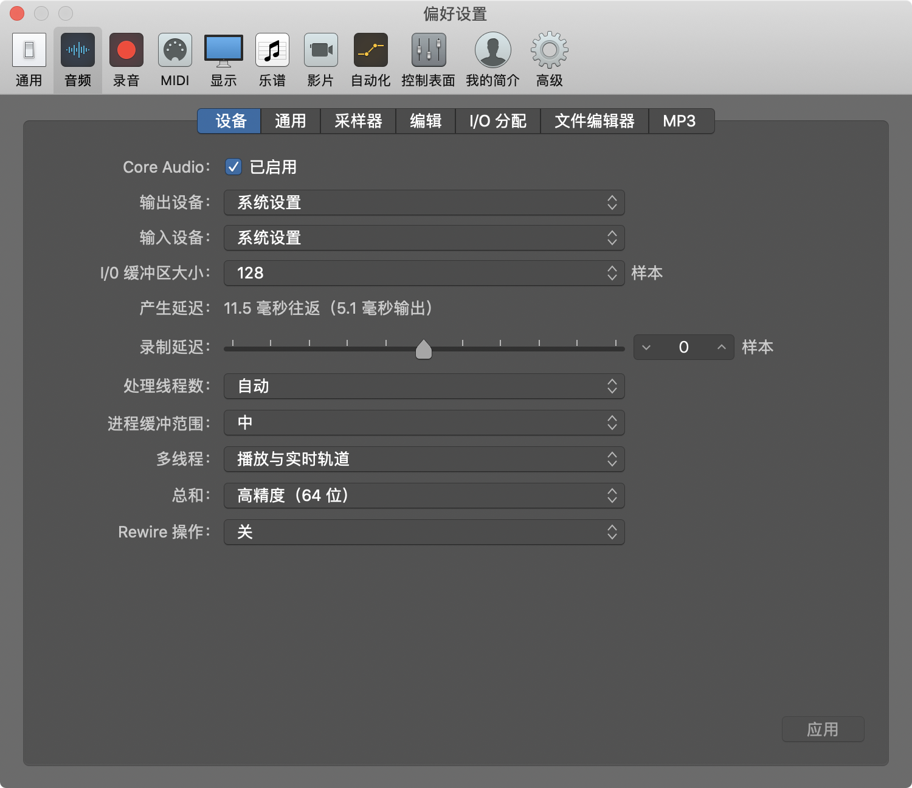
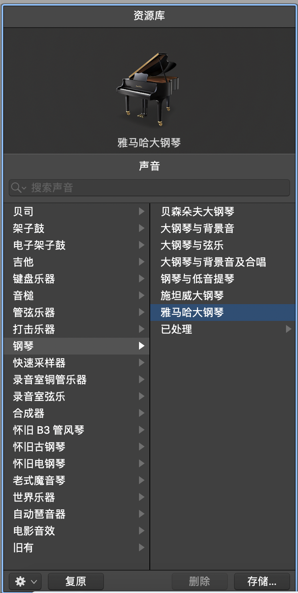
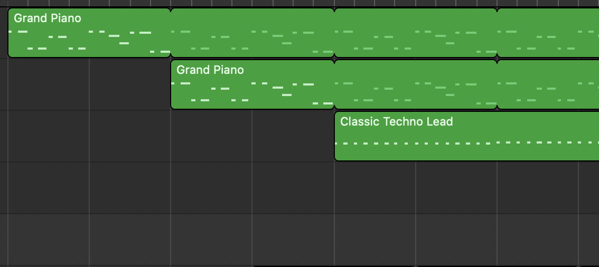

# TODO

## 新功能

（1）[x] 应用品牌全部统一为 Chrodis。还有 Electron 的系统名称，图标你就弄一个图标替换掉。

（2）[x] 加一个系统偏好设置，类似下面这个。

（3）[x] 左侧有“资源库”，可以把轨道更换为不同的乐器，类似下图。

（4）[x] MIDI pattern 里面要能显示音符的缩略图，如下图所示。

（5）[x] 加入更多的快捷键

- 按住 Option 再双指滑动触控板可以上下方向放大缩小
- Cmd+A 可以全选。
- 更多快捷键已整理到 `docs/SHORTCUTS.md`。

## 解决 bug

（1）[x] 现在播放没有声音了。修复一下。
